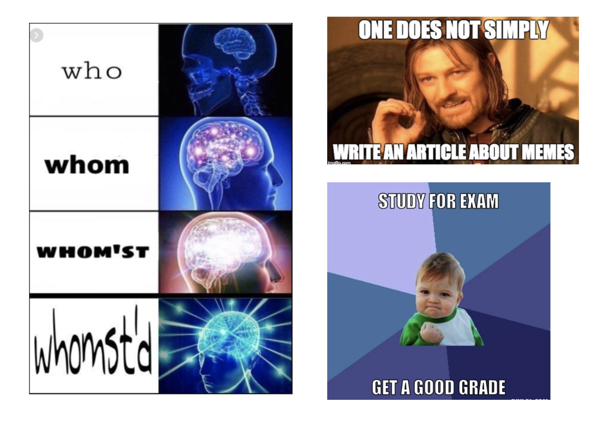
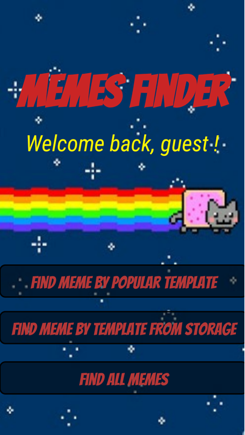
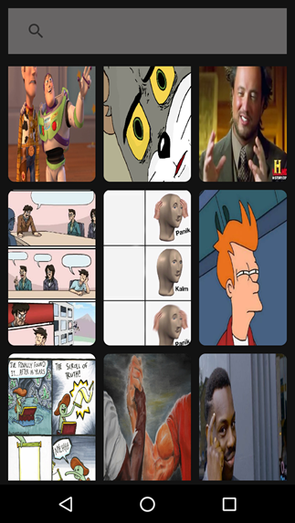

# Memes Finder Project

## Course:

- סדנה לפרויקטים - 89385

### Students:

- Omri Fridental
- Guy Wolf
- Oren Schwartz

### Instructors:

- Dr. Ariel Roth
- Asi Barak

# 1 Intro

## 1.1   Vision ✨

Our vision was based on a real-life problem – ***gallery management.***

Gallery management refers to searching images in the gallery, deleting unwanted images, and so on. one would want to use it for many different reasons -  quick and easy search of images, phone memory management and more.

We wanted to create an Images specific pattern matcher.

The basic idea behind this, is that some users sometimes want to filter their gallery based on some non-trivial image pattern. 

This pattern is often hard to define mathematically. Therefore, we can use machine learning and image processing algorithms to find all images that match this pattern in one’s gallery.

we wanted to create an application which uses this pattern matching on popular real life problems -

- ***memes classifying -** given an image, is it a meme?*
- ***searching by meme template -** given an image, and a template image, is the image a meme that is constructed using the template image?*

## 1.2  Background about Memes 😂

### What is a meme?

It is a bit complicated to explain for those who have not heard the term before.

**Wikipedia** defines a *meme*:

> ”an idea, behavior, or style that spreads by means of imitation from person to person within a culture and often carries symbolic meaning representing a particular phenomenon or theme”

But a good rule of thumb, that works for most memes, is that a meme is a picture, with some funny text on it. 

a few examples may explain it better than all:



### What is a meme template?

A meme template is a plain image that has room for text, or other modifications. These images are specifically designed to create memes.

people mostly use well known template - each templates has a say or a certian logic to follow when users captioning it.

for example, for the 3 examples given above:

- "Expanding Brain" meme template - shows a progress of mind in some things.
- "One does not simply" meme template - describes a difficulty of a task.
- "Success kid" meme template - designate either success or frustration.

the important note about meme templates is that each template can be used a whole lot of times.

for example, this are a few different uses of the "Drake" meme template (which basically describes good option and bad option):


## 1.3  Why did we choose memes? 🖼️

An important thing to note about memes is that the well known templates, are filling the internet - there are hundred of thousands memes captioning each template, going mainly through social medias, chatting applications and more.

most people today, when knowing or not, have phone galleries that are filled with hundred or even thousands of pictures of memes. whether they made it or someone sent it to them, or to a group chat they are in.

Therefore, there a few common use cases we thought we can solve:

- People who love the absence of memes in their gallery, and want to **find memes** in there. more specifically, they would want to **search memes** that **correspond** to well known **templates** of their choice, or basically any other image that can be treated as a template.
- People who hate having so many memes in their gallery, and would like to **delete** them all.

In both cases, the people would have to search manually. 

This is where we come in. Our app searches memes in the user's gallery, and give the user the option to search by specific meme template.

# 2   Application use demonstration 📱

Our goal with the application, was to create a user-friendly environment that can help the user perform the said searching. 




# 3  Application Architecture 👷🏻‍♂️

## 3.1  Application flow chart ➡️

The below will explain the logic behind the demonstration:

### Part 1: Authentication


we created a loading animation activity, and after that, a **not mandatory** authentication.

the advantage of authenticating is a caching of the processing results, in case of logging the app from different phone, (with same gallery).  it will be described in more details later.

We used **firebase** authentication.

### Part 2:  Processing (Model)


**this part is the core of the application -** 

We are iterating through the pictures in the user's gallery - camera, screenshots, Whatsapp pictures and more.

for each picture:

1. Compute prediction:

    We use our maching learning model, to **classify this picture -**

    - meme
    - not meme

2.  Compute image hash:

if the picture was a meme, we use our preceptual hashing (image hashing) algorithm on it. it will give a 64 bit long string called image hash, which is the summery of the picture. 

the goal of it is to help us later compare similarity of two images, with pre-calculated separate computation. 

specifically, it will help us find if two memes are of the same template.

That parts generate a dictionary of image paths (in the gallery) →  predictions and  image hashes.

notice that we cache this computations, both locally and remotely.

so the full flow would be:

1. get computations from cache:
    1. from local cache db.
    2. if it wasn't on local cache, on remote cache db.

2. compute on non cached images
3. update cache about the new computations on local and remote cache db.

An important architecture observation is that:

1. get from local cache - *synchronous.* local db is fast enough to get all computations at once.
2. get from remote cache - *asynchronous.* remote db is not as fast, and we prefer start computing, even on already computed images than block for long time.
3. update cache - asynchronous for each image separately, we don't know when the iteration will end, on large gallery, and need to do it as soon as possible.

### Part 3: User POV application (View + Controller):


This part opens a menu that has 3 main functions:

1. “Find meme by popular template”.
2. “Find meme by template from storage”.
3. “Find all memes”.

**memes classifying:**

**“Find all memes”** - will show a gallery-like view of all memes in the gallary.

**memes search by templates:**

**“Find meme by popular template”** - shows the user a list of popular templates, downloaded from urls loaded from our db. the user can search for popular templates - such as "drake", and it will show all matching templates. at the end the user will chose a template image.

“**Find meme by template from storage”** - lets the user chose a gallery image as the template image. For example if the user wants to search for a meme captioning a picture of their friend.

after choosing a template image using one of the two ways seen above, the app will use the classifications and calculated image hashes for the images in the gallary to create a list of all the matching memes of that templates in the users gallery.

Both options will eventually open a view that lists the results, and let the user do common actions on the images:

- share
- delete
- multiple select (by long pressing)
- multiple share
- multiple delete
- open in actual gallery

Note about the templates bucket - due to the download of the popular templates through urls, we cached the templates as can be seen in the architecture flow chart.

## 3.2  Model Specifications 🧠

### 1  The classification model - meme or not a meme?

**Data Scraping:**

To begin the making of the model, a dataset was needed. 

We created a Python script using the dev API of **Reddit,** a popular site that hosts many forums, to extract images – both from communities which are dedicated to memes and from those which are not. 

Special care was given to choosing the communities - we chose those that match the images of an average gallary, to create a training set that is the most similar to real life data.

examples for the reddit communities chosen, with their ratios in the training set:

```python
memes_subreddits = ['memes', 'dankmemes']

major_non_memes_subreddits = ['pics', 'Twitter', 'FacebookCringe', 'texts', 'cityporn', 'selfie', 'NatureIsFuckingLit']
minor_non_memes_subreddits = ['sports', 'cats', 'carporn', 'rarepuppers', 'ps4']

# ratio between memes and non memes sub reddits:
memes_ratio = 0.5
non_memes_ration = 0.5

# ratio between non memes common pictures on a gallery, to less common pictures on a gallery.
major_ratio = 0.7
minor_ratio = 1 - major_ratio
```

training set size: 20,000. 10,000 images from each class.

splitted to a training and validation sets in a 9-1 ratio.

**Training The model:**

We decided to use the *Python Tensorflow package*, for several reasons:

1. It was easy to create models in, which helped to create, train, and test many models.
2. Tensorflow models can be used in other programming languages by an API, which makes the final model easier to integrate in any framework that we chose, and specifically those for an Android app.
3. Tensorflow models can be specifically converted to models suited for apps using a framework named Tensorflow Lite. This allowed for fast, efficient, and small models, which was exactly what was needed for this project.

The model we decided to use was a Convolutional Neural Network. Such a network was created and trained to great results – over 95% accuracy on the validation set. However, the network was ridiculously big – over 1.5GB before being converted to Tensorflow Lite and over 500MB after the conversion – and very slow. Therefore, the network had to be cut down.

Many different network designs were tested, with the final network being:

```python
model = Sequential([
    Conv2D(16, 4, padding='same', activation='relu', input_shape=(256, 256 ,3)),
    MaxPooling2D(),
    Dropout(0.2),
    Conv2D(32, 4, padding='same', activation='relu'),
    MaxPooling2D(),
    Conv2D(32, 4, padding='same', activation='relu'),
    MaxPooling2D(),
    Dropout(0.2),
    Flatten(),
    Dense(256, activation='relu'),
    Dense(2)
])
```

This model achieved an accuracy of 88% on the validation set, while only having a memory footprint of 5MB! However, false positives were still a problem – even 14% is noticeable. For that we needed to adjust the threshold of the results of the model.

When given an image, our model returns 2 values that sum up to one:

- probability of the image being a meme
- probably of the image not being a meme

Usually we pick the bigger number, as that is the more probable result.

To minimize false positives, however, we could adjust said threshold to reflect our need for a more rigorous process for an image to be defined as a meme. 

The final threshold that was set on for an image to be declared a meme was 0.7, which minimized false positives to less than 2% while keeping the false negatives low. 

### 2  Memes Similarity model - Perceptual hash model.

**How does the image hash algorithm work?**

pseudo code:

 

```json
image hash (image):

1. resize image to 64x64.
2. replace each white / black / any r=g=b pixel with transparent pixel.
3. resize image to 8x8, containing toal of 64 pixels (r,g,b)
4. grayscale the image. now its containing a 64 values.
5. calculate average of the 64 values -> avg.
6. create a string, length 64. in its i'th place:
	6.1 put 0 if the i'th value < avg.
  6.2 put 1 if the i'th value >= avg.

7. return this string, it is the image hash.

```

important notes about this algorithm:

- it is simple and fast, which was very important to us.
- it was designed specifically for memes, which have a lot of white and black pixels that really doesn't matter, such as a white background for many templates and the text of the meme. therefore we leave them.

**checking if memes are similar - i.e. are they from the same template?**

pseudo code:

```json
is similiar (image1, image2):

1. image hash1 <- image hash(image1)
2. image hash2 <- image hash(image2)
3. distance = hamming distance(image hash1, image hash2)
4. threshol = 1/5 * 64
5. if distance < threshold:
	5.1 return "similar"
6. else:
	6. return "different"

```

notice what the threshold means - 4/5 of the hash of both images needs to be the same.

it leaves enough room for small changes between the images but not enough room for a lot of false positives.

## 3.3   Database specifications 📦

### Computations cache database:

**remote cache: firebase DB – No SQL**

Schema:

```json
<user id> → {

  <path>: gallery image path on phone

  <prediction>: isMeme prediction [yes/no]

  <imageHash> imageHash

}
```

Example:

```json
{
  "0ilcOZgolYWebTVeTI4GZr8kYMi2" : {
    "SLASHstorageSLASHemulatedSLASH0SLASHDCIMSLASHCameraSLASH019ru2eclu251POINTpng" : {
      "prediction" : true
      "imageHash" : "0000000000001111000000000100111100000000110001110000000011101111000000000000111100000000000010010000001111111101000000101100101100000000000011010000000000001101000101001000111100000100111111110001010011111111000001001111110100000100111011010000111111111111",

    },
    "SLASHstorageSLASHemulatedSLASH0SLASHDCIMSLASHCameraSLASH01gx2tropv251POINTjpg" : {
      "imageHash": null,
      "prediction" : false
    },
    "SLASHstorageSLASHemulatedSLASH0SLASHDCIMSLASHCameraSLASH0225mth1sv251POINTjpg" : {
      "imageHash" : "10011000000001111111000000100111100000000111111110000110011101111100100000110111100000001000010010000001111111101000000101100101100000000000011010000000000001101000101001000111100000100111111110001010011111111000001001111110100110100111011010000100001111111",
      "prediction" : true
    },
}
```

**local cache: SQLite - SQL.**

database manager and helper code at “src/main/java/com/example/memesfilter/sqlite_local_db” package.

```java
// Table Name
public static final String TABLE_NAME = "PREDICTIONS";
// Table columns
public static final String _PATH = "_path";
public static final String PREDICTION = "prediction";
public static final String IMAGE_HASH = "image_hash";
```

### Templates Database

we could have made a bucket of images, but due to copyright issues we decided to use a db of urls to the images.

Schema:

```json
<random-template-id> : {

  <path>: url to the image resource

  <title>: template title

}
```

Example:

```json
{
"-M9dUsBalqBlTZZx6M_M" : {
    "path" : "https://imgflip.com/s/meme/Distracted-Boyfriend.jpg",
    "title" : "Distracted Boyfriend"
  },
  "-M9dUsN9NQEyS2Xtm684" : {
    "path" : "https://imgflip.com/s/meme/Drake-Hotline-Bling.jpg",
    "title" : "Drake Hotline Bling"
  },
  "-M9dUsXR6BpNvHyZfz8G" : {
    "path" : "https://imgflip.com/s/meme/Two-Buttons.jpg",
    "title" : "Two Buttons"
  }
}
```

## 3.4  Technologies used 👨🏻‍💻

### **Languages used:**

- Python - model data scraping, model training, many tests that were conducted during the development.
- Java - android mobile application development.

### **Main Technologies used:**

- Android & Android Studio - mobile development.
- Firebase - cloud service for mobile application development:
    - Authentication
    - Database - firebase realtime - for remote db.
- Tensorflow, Keras - model training
- Tensorflow Lite - running lite weight model on android.
- SQLite - android sql database for user local cache db.
- Reddit-API – free dev API, used to scrape images.

### **Development Tools used:**

- Jira - agile task management
- Confluence - knowledge sharing (characterization and project planning)
- git + github - version control system.
- Whimsical - system design and architecture planning.

# 4  Summery

overall, this project was a great opportunity for us to create a brand new and interesting application based on a subject we like - memes.

we learned a lot about:

- machine learning
- android development
- project managing
- time scheduling
- team work

we had a great time.

## Thanks for reading ✅


##
